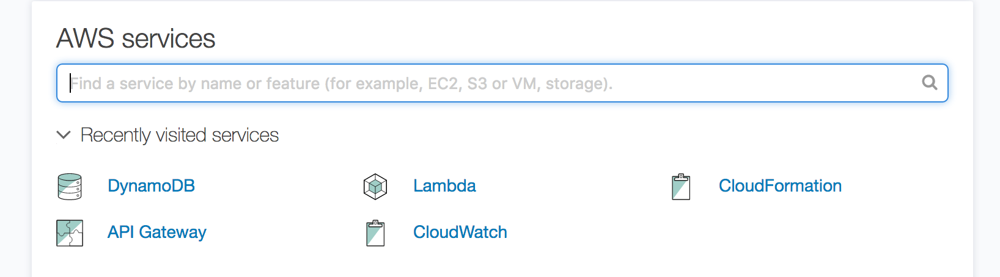
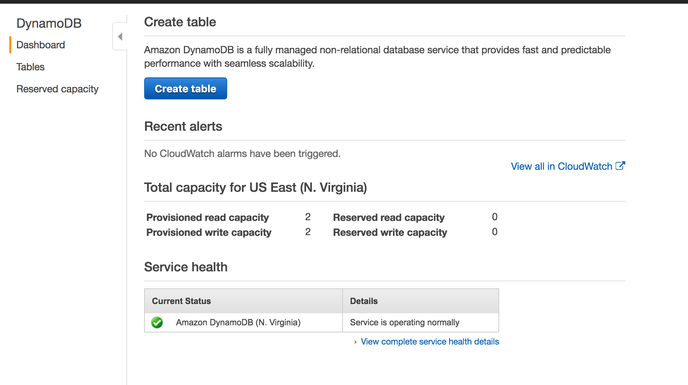
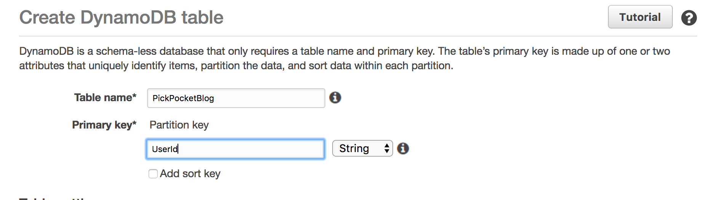

# Creating and Deploying Serverless Architectures on AWS.

# Part 0: History

Intrepid prides itself on its ability to quickly train new talent through the company's apprentice program. Int his program, new programmers who may not have mobile development experience take a deep dive into the platform of their choice and get hands on experience by working on several projects. The first project they do is a solo project aimed at easing them into the environment at their own pace. In the past, their first app would be either a full UI based app, or one that worked against an existing API.

More recently, we had decided to try something new and teach MVP and MVVM patterns right from the start with their initial project. Thus, PickPocket was born as a fun way to introduce these concepts. PickPocket would be a small game based around Mastermind that would help us teach concepts like MVP, Retrofit, and Recycler Views. However, as this was a brand new custom app, this would mean we needed a backend to test against.

Armed with Python experience, a free tier AWS account, and vaguely remembering that AWS Lambda's existed, we spent a few weekends throwing together a backend for the new project.

This posting is broken up into two main parts. In the first section we'll talk about deploying everything manually the way we initially did. In part two we'll show you how to leverage cloud formation to quickly and automatically deploy the environments.

# Part 1: Manual Deployment

## i. Components

The system is made up of a series of AWS Lambdas, which interface with a DynamoDB, and interact with the outside world through an AWS API Gateway. We will also use AWS IAM to configure the permissions on each Lambda and AWS SNS to set up push messaging.

## ii. Setting up DynamoDB

As all of our lambda functions will need to reference a Database, we will configure DynamoDB first. DynamoDB is essentially AWS's version of MongoDB, a NoSQL Database that lives in the cloud. First We'll log into our AWS console and select DynamoDB.



Then select "Create table"



Then enter in a title and a Primary Key. For this project, our primary key will be the UserID which we will store as a string. After selecting these two parameters click create. We now have a nice and shiny NoSQL Database to work out of. You can click the "Items" tab at the top to take a look at the database structure but there isn't much to see yet so we'll come back to look at this later.



## iii. Creating Lambda Functions

Now we'll move on to creating our first lambda function. The main functions we are going to create are:

* `FetchUsers` - Returns a list of the userIDs of every person in the database along with the length of their combination.
* `CreateUserBasic` - Supply a userId, DisplayName, and Combination, returns an error if username taken, otherwise returns success and a token.
* `PickPocket` - Provide a UserId to pick, the token of the current user, and a combination guess to attempt to pick the lock of another user.
* `EditCombination` - Provide a token and new combination to change the lock associated with that user.


## Overview of Project:

The project is structured as a series of AWS Lambda functions with a DynamoDB database to store information. The lambda functions can be deployed using AWS API Gateway to allow for the remote access of the endpoints. Initially, this was done in a very manual process. There is now a set of scripts built around Amazon Cloud Formation to allow for a quick deployment of the system to any AWS account.

Currently the database and SNS integration still need to be configured manually.

* [Deploying](#deploying) - The functions can be copy and pasted manually to aws or the shell script can handle their generation automatically.
* [Functions](#functions) - Create a UI that allows you to play a one-way Mastermind game against a computer opponent.
* [Previous Guesses](#previous-guesses) - Add a list of previous guesses to the UI to make it easier to remember what you’ve already guessed.
* [Networking](#networking) - Add a networking class that allows you to crack a remote lock using an API.

## Deploying

To deploy automatically, first configure the functions in `config.json` similar to below:

```Javascript
{
  "functions" : [
    {
      "function":"FetchUsers.py",
      "api_path":"users",
      "method":"GET"
    },
    {
      "function":"CreateUserBasic.py",
      "api_path":"users",
      "method":"POST"
    },
    {
      "function":"PickLockUrl.py",
      "api_path":"pick/{victim}",
      "method":"POST"
    }
  ]
}
```

Where:
* `function` is the name of the python file
* `api_path` is the route that will be used in the api gateway
* `method` is the type of request the lambda function will correspond to (ex: GET, POST)

Once that is done call `deploy.sh` with the name you would like to use for the stack:

```Bash
  ./deploy.sh STACKNAME
```

## Functions

Below is a quick overview of the different lambda functions in this repository, for more information please refer to the individual files:

* `FetchUsers` - Returns a list of the userIDs of every person in the database along with the length of their combination.
* `CreateUserBasic` - Supply a userId, DisplayName, and Combination, returns an error if username taken, otherwise returns success and a token.
* `PickPocketUrl` - Provide a UserId to pick, the token of the current user, and a combination guess to attempt to pick the lock of another user.
* `UpdateDisplayName` - Allows a user to change their display name. UserId cannot be changed.
* `EditCombination` - Provide a token and new combination to change the lock associated with that user.
* `PickPocket` This is a deprecated function and should not be used anymore. It does not require the token to pick a user.

## Quirks
When you first run the deployment script you may receive an error that there is no file `deploy.json`. This is due to a quick hack that first deletes the existing file if its there before running `concat_files.py.` It will hopefully be fixed in future updates.
