# Creating and Deploying Serverless Architectures on AWS.

# Part 0: History

Intrepid prides itself on its ability to quickly train new talent through the company's apprentice program. Int his program, new programmers who may not have mobile development experience take a deep dive into the platform of their choice and get hands on experience by working on several projects. The first project they do is a solo project aimed at easing them into the environment at their own pace. In the past, their first app would be either a full UI based app, or one that worked against an existing API.

More recently, we had decided to try something new and teach MVP and MVVM patterns right from the start with their initial project. Thus, PickPocket was born as a fun way to introduce these concepts. PickPocket would be a small game based around Mastermind that would help us teach concepts like MVP, Retrofit, and Recycler Views. However, as this was a brand new custom app, this would mean we needed a backend to test against.

Armed with Python experience, a free tier AWS account, and vaguely remembering that AWS Lambda's existed, we spent a few weekends throwing together a backend for the new project.

This posting is broken up into two main parts. In the first section we'll talk about deploying everything manually the way we initially did. In part two we'll show you how to leverage cloud formation to quickly and automatically deploy the environments.

# Part 1: Manual Deployment

## i. Components

The system is made up of a series of AWS Lambdas, which interface with a DynamoDB, and interact with the outside world through an AWS API Gateway. We will also use AWS IAM to configure the permissions on each Lambda and AWS SNS to set up push messaging.

## ii. Setting up DynamoDB

As all of our lambda functions will need to reference a Database, we will configure DynamoDB first. DynamoDB is essentially AWS's version of MongoDB, a NoSQL Database that lives in the cloud. First We'll log into our AWS console and select DynamoDB.


Then select "Create table"


Then enter in a title and a Primary Key. For this project, our primary key will be the UserID which we will store as a string. After selecting these two parameters click create. We now have a nice and shiny NoSQL Database to work out of. You can click the "Items" tab at the top to take a look at the database structure but there isn't much to see yet so we'll come back to look at this later.


## iii. IAM

Now we need to create an IAM role for the lambda function we will create. The lambda role will give it the authority to access other sections of AWS. To begin, return to the dashboard and click on "IAM", then "Roles", and "Create new Role."

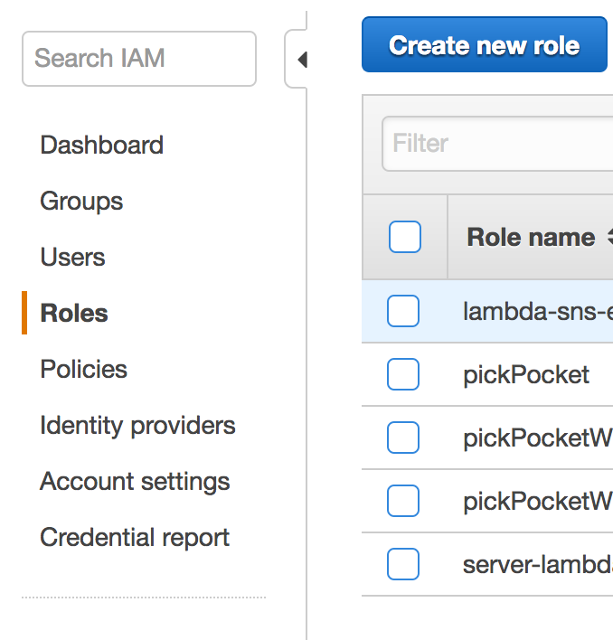

On the next page, scroll down under "AWS Service Role" and select AWS Lambda.

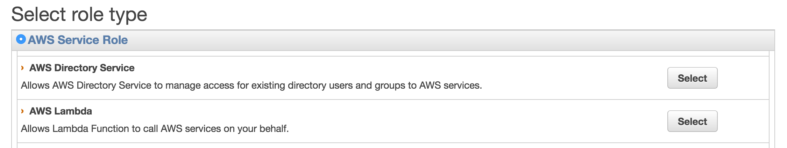

Then select AmazonDynamoDBFullAccess. We can choose to create separate IAM policies for when we need to read and write but for the first lambda we will need access to both.

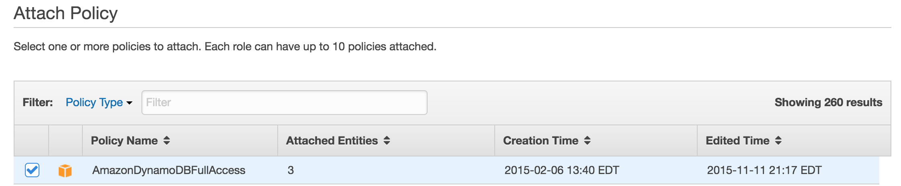

On the last page, name your lambda and click "Create Role"

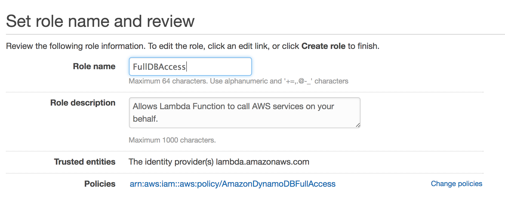

## iv. Creating Lambda Functions

Now we'll move on to creating our first lambda function. The main functions we are going to create are:

* `FetchUsers` - Returns a list of the userIDs of every person in the database along with the length of their combination.
* `CreateUser` - Supply a userId, DisplayName, and Combination, returns an error if username taken, otherwise returns success and a token.
* `PickPocket` - Provide a UserId to pick, the token of the current user, and a combination guess to attempt to pick the lock of another user.
* `EditCombination` - Provide a token and new combination to change the lock associated with that user.

As we don't have any data in the data table yet, we'll start with "CreateUser" so we can begin populating our DynamoDB. Go back to the console and click "Lambda" then "Create Lambda."

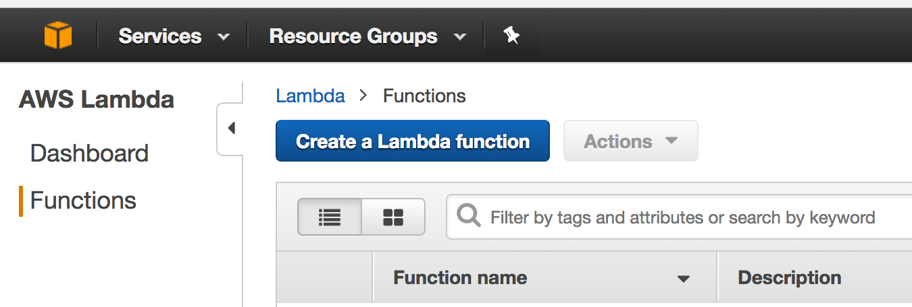

On the "Select Blueprint" page click "Blank Function."

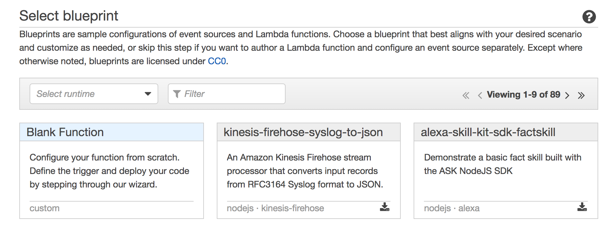

On "Configure Triggers" leave this blank and click next.

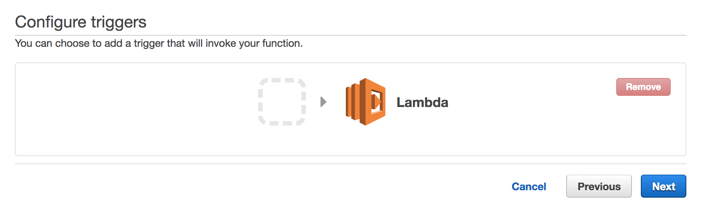

And then you should see the "Configure Function" page.

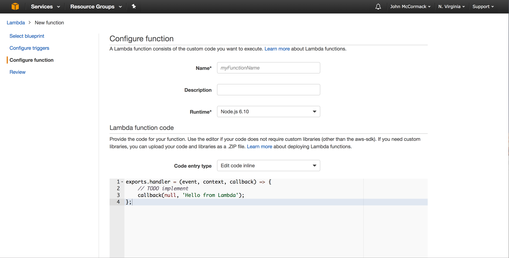

Name the function "CreateUser", and set a description if you'd like. Then under runtime select "Python 2.7" (or 3.6 if you prefer). Under code entry we will select edit code inline. You can also choose to upload a zip file of your python file or pull one from S3. I chose to edit inline as we were creating these functions as we went and being able to quickly test the lambda functions became extremely helpful.

In the code block at the bottom, copy and paste this code. We'll discuss it in a bit but first let's finish creating the lambda function.

```Python
import json
import boto3
import decimal
from boto3.dynamodb.conditions import Key, Attr

"""
JSON Format:
    "userId":"JohnM",
    "displayName":"John Mack",
    "combination":"[1,2,3,4]"
"""
validDigits = [1, 2, 3, 4, 5, 6]

def lambda_handler(event, context):
    output = {}
    dynamodb = boto3.resource('dynamodb')
    table = dynamodb.Table('PickPocketBlog')

    userId = event['userId']
    combination = event['combination']
    combination = json.loads(combination)

    queryTable = table.query(KeyConditionExpression=Key('UserId').eq(userId))

    if (queryTable['Count'] != 0):
        output["response"] = "USER_EXISTS"
        return output

    if (not validateCombination(combination)):
        output["response"] = "INVALID_COMBINATION_FORMAT"
        return output

    if 'displayName' in event:
        displayName = event['displayName']
    else:
        displayName = userId

    response = table.put_item(
       Item={
            'UserId': userId,
            'DisplayName': displayName,
            'Combination': combination,
        }
    )

    output = {}
    output["response"] = "success"
    return output

def validateCombination(combination):
    try:
        for digit in combination:
            if int(digit) not in validDigits:
                print digit
                return False
        return True
    except:
        return False
```

Scroll down and select "Choose and existing role" and set the existing role to the one we created earlier.

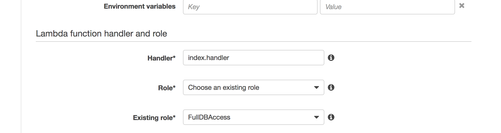

Then click "Create Function" and we're good to go. Now let's talk about the code we just added.

first the imports:

```Python
import json
import boto3
import decimal
from boto3.dynamodb.conditions import Key, Attr
```
Json and decimal are fairly standard libraries. Boto3 is the library for interacting with AWS resources from within python. We will directly import the DynamoDB libraries to make the code a bit cleaner.

```Python
"""
JSON Format:
    "userId" = "JohnM",
    "displayName" = "John Mack",
    "combination" = "[1 2 3 4]"
"""
validDigits = [1, 2, 3, 4, 5, 6]
```
The next comment is just a sanity check to show us what the data is going to look like. We also create a list of the digits we want to consider "valid." The original mastermind dealt with 6 colors so here we only allow 6 numbers in our combinations.

```Python
def lambda_handler(event, context):
    output = {}
    dynamodb = boto3.resource('dynamodb')
    table = dynamodb.Table('PickPocketBlog')
```

Next we define the function itself. AWS defaults to calling the function lambda_handler. You can change it but you also have to change the name in the configuration of the lambda instance, for now just leave it as it is to save time.

We initialize an empty dictionary to store our output. These lambda functions will return JSON data so its easiest to create a dictionary to store the output. We also create an instance of the dynamodb resource and then get the table we just created. Make sure the name of the table matches the name of the table you created in the last step.

```Python
userId = event['userId']
combination = event['combination']
combination = json.loads(combination)
```

`event` is one of the parameters passed into the lambda function. This gives us access to a dictionary of the JSON data passed into the lambda function. We pull out the `userId` and the `combination` from the event and store them in the corresponding variables.

```Python
queryTable = table.query(KeyConditionExpression=Key('UserId').eq(userId))

if (queryTable['Count'] != 0):
    output["response"] = "USER_EXISTS"
    return output

if (not validateCombination(combination)):
    output["response"] = "INVALID_COMBINATION_FORMAT"
    return output
```

Next we run a query against our table in DynamoDB to see if the `userId` exists in the database already. We simply check the `Count` of items returned from the query table to see if its anything other than 0 and return a response if there is an error. Next we check to see if the combination is valid and return an error message if its not. Our validation is pretty simple for this project as we were operating in a controlled environment. Be sure to sanitize all your inputs if you were implementing this for real. The validation function is shown below.

```Python
def validateCombination(combination):
  try:
      for digit in combination:
          if int(digit) not in validDigits:
              print digit
              return False
      return True
  except:
      return False
```

We allow for non-unique display names in addition to the UserId. The display name is optional so it is replaced with the userId if its empty.

```Python
if 'displayName' in event:
    displayName = event['displayName']
else:
    displayName = userId
```

Finally we actually write the data to the data table and output a success response.

```Python
response = table.put_item(
   Item={
        'UserId': userId,
        'DisplayName': displayName,
        'Combination': combination,
    }
)

output = {}
output["response"] = "success"
return output
```

## v. Testing

Now that we understand how everything works together, let's test out the setup. Click "Action", then "Configure Test Event."

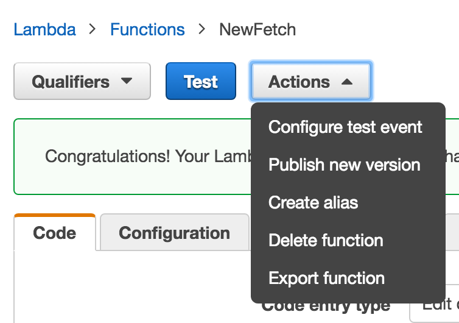

In the window that pops up type in:

```Javascript
{
    "userId":"JohnM",
    "displayName":"John Mack",
    "combination":"[1,2,3,4]"
}
```

Now click "Save and Test" and at the bottom you should see:

```Javascript
{
  "response": "success"
}
```

If you run the test again you'll see:

```Javascript
{
  "response": "USER_EXISTS"
}
```

Because we already created the user. Great! We have our first Lambda expression setup. We need to make a few more, but first lets go ahead and make our first API Endpoint and connect it to this lambda function.

## vi. API Gateway

Go back to the console and then switch over to Amazon "API Gateway". API Gateway will let us open up our Lambdas to the outside world. A word of warning, creating an api is free but keeping it deployed will rack up a bill if you're not still on your 1 year free tier. Once you're on the API Gateway page, go ahead and click the blue "Create API" button.

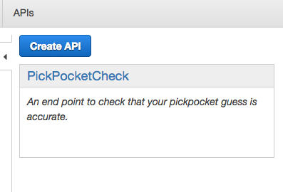

Then just name your API and click "Create API."

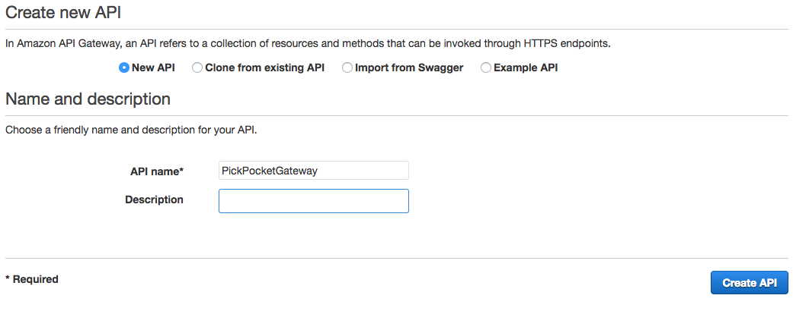

There are two main sections to an api gateway, "Resources" and "Methods." Resources are essentially the the path to the function. A method is the function itself and what we will attach the lambda function to. A Resource can have multiple methods (such as GET and POST) associated with it as well as multiple sub-resources. To begin, we'll make a resource first. Click "Actions" then "Create Resources."

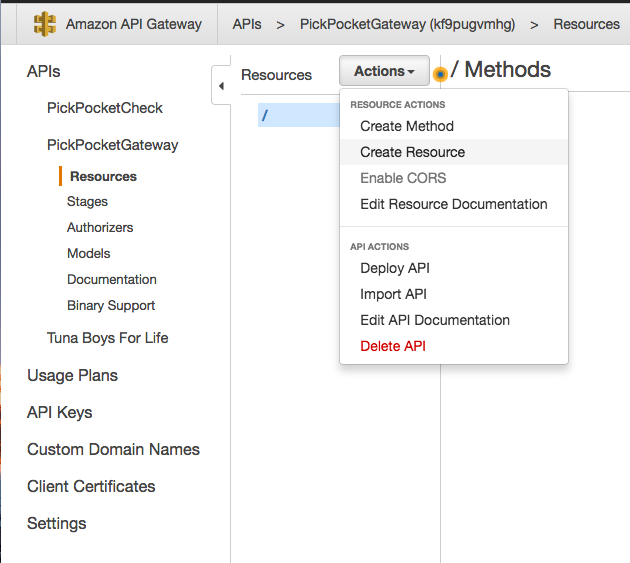

Then add a resource name. The resource path will be autopopulated based on the resource name but you can also feel free to edit it. When you're done, click create resource.

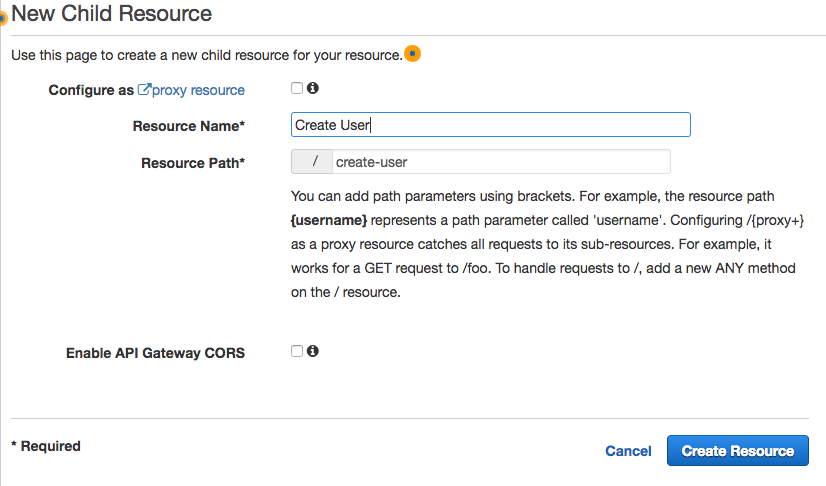

Now we can see the resource on the main apigateway page under the route resource.

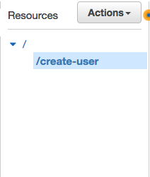
